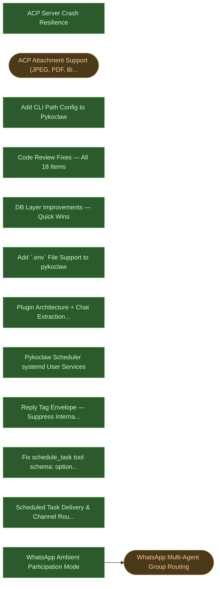

# Pykoclaw Backlog

_Auto-generated by `query_backlog.py`. Do not edit manually._

## Priority Queue

| # | Status | Plan | Effort | Depends On |
|---|--------|------|--------|------------|
| 1 | 📋 Backlog | **WhatsApp Multi-Agent Group Routing** | Medium-Large | wa-ambient-participation |
| 2 | 📋 Backlog | **ACP Attachment Support (JPEG, PDF, Binary Files)** | Medium | — |

## Dependency Graph

All plans (done + backlog) and their dependencies:

## Completed Plans

| # | Status | Plan | Effort | Depends On |
|---|--------|------|--------|------------|
| 1 | ✅ Done | **ACP Server Crash Resilience** | Quick | — |
| 2 | ✅ Done | **Add CLI Path Config to Pykoclaw** | Short | — |
| 3 | ✅ Done | **Code Review Fixes — All 18 Items** | Medium (3–4 hours) | — |
| 4 | ✅ Done | **DB Layer Improvements — Quick Wins** | Quick (<2h total) | — |
| 5 | ✅ Done | **Add `.env` File Support to pykoclaw** | Quick | — |
| 6 | ✅ Done | **Plugin Architecture + Chat Extraction + WhatsApp Plugin** | Large | — |
| 7 | ✅ Done | **Pykoclaw Scheduler systemd User Services** | Quick | — |
| 8 | ✅ Done | **Reply Tag Envelope — Suppress Internal Monologue** | Quick | — |
| 9 | ✅ Done | **Fix schedule_task tool schema: optional parameters** | Quick | — |
| 10 | ✅ Done | **Scheduled Task Delivery & Channel Routing** | Medium-Large | — |
| 11 | ✅ Done | **WhatsApp Ambient Participation Mode** | Medium | — |

---
_Last generated: see git log_
